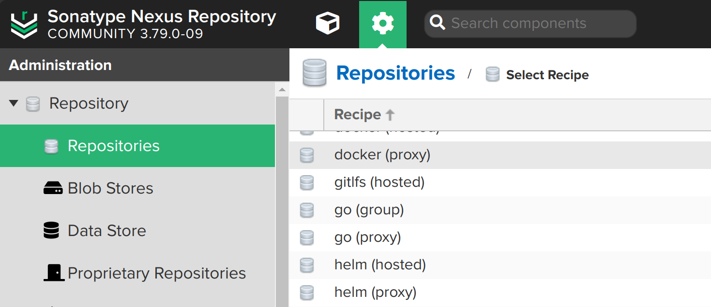
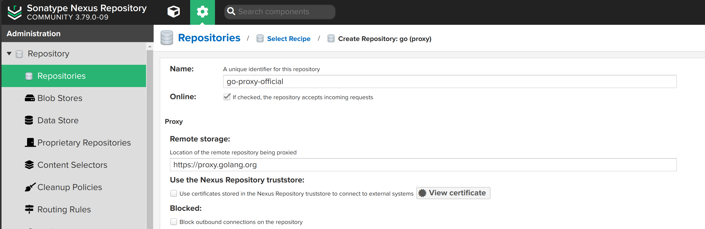
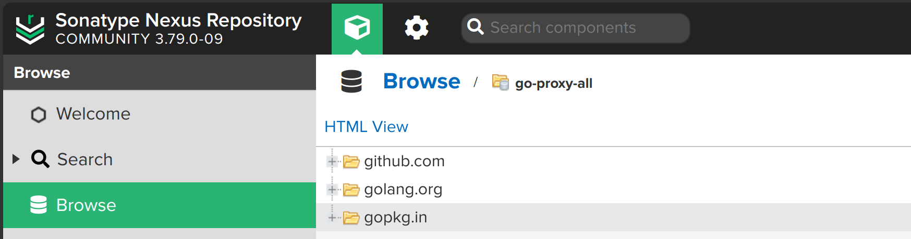
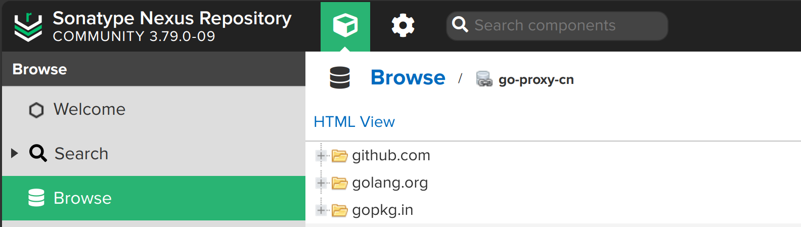
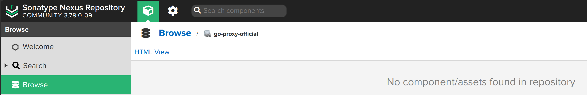

## nexus 仓库类型

默认情况下 nexus 只支持 golang 的 proxy 和 group 类型的仓库，没有 hosted 类型的仓库：



从下面的官方文档

https://help.sonatype.com/en/go-repositories.html#configuring-a-go-project-in-sonatype-nexus-repository

得知：

> You can serve and cache modules remotely from resources such as GitHub. Currently, hosted repositories aren’t available. 
>
> 您可以从 GitHub 等资源远程提供和缓存模块。目前，hosted 存储库不可用。

## 配置 go proxy 仓库

创建新的 go proxy 仓库：



注意：取消勾选 `Cache responses for content not present in the proxied repository` 选项。

多建几个 proxy 仓库：

- go-proxy-official: https://proxy.golang.org
- go-proxy-official-io: https://goproxy.io/
- go-proxy-cn: https://goproxy.cn

其他备选（暂时不用）：

- go-proxy-aliyun: https://mirrors.aliyun.com/goproxy/
- go-proxy-tencent: https://mirrors.cloud.tencent.com/go/
- go-proxy-ustc: https://goproxy.cn

再新建一个名为 go-proxy-all 的 group 类型的仓库，将上述 proxy 仓库添加进去，顺序为：

- go-proxy-cn
- go-proxy-official-io
- go-proxy-official

记录此时仓库的地址备用，如：

http://192.168.0.246:8081/repository/go-proxy-all/


## 验证

> 备注： 在设置好 goproxy 之后再验证

```bash
mkdir -p ~/work/code/temp/go-demo
cd ~/work/code/temp/go-demo

git clone https://github.com/gobuffalo/buffalo

cd buffalo
go build
```

以下为输出:

```bash
go: downloading github.com/dustin/go-humanize v1.0.1
go: downloading github.com/gobuffalo/envy v1.10.2
go: downloading github.com/gobuffalo/events v1.4.3
go: downloading github.com/gobuffalo/flect v1.0.0
go: downloading github.com/gobuffalo/grift v1.5.2
go: downloading github.com/gobuffalo/logger v1.0.7
go: downloading github.com/gobuffalo/plush/v4 v4.1.18
go: downloading github.com/gobuffalo/refresh v1.13.3
go: downloading github.com/gorilla/handlers v1.5.1
go: downloading github.com/gorilla/mux v1.8.0
go: downloading github.com/gorilla/sessions v1.2.1
go: downloading github.com/gobuffalo/nulls v0.4.2
go: downloading github.com/monoculum/formam v3.5.5+incompatible
go: downloading github.com/sirupsen/logrus v1.9.0
go: downloading github.com/gobuffalo/meta v0.3.3
go: downloading github.com/spf13/cobra v1.6.1
go: downloading github.com/gobuffalo/github_flavored_markdown v1.1.3
go: downloading github.com/gobuffalo/helpers v0.6.7
go: downloading github.com/gobuffalo/tags/v3 v3.1.4
go: downloading golang.org/x/text v0.6.0
go: downloading github.com/joho/godotenv v1.4.0
go: downloading github.com/rogpeppe/go-internal v1.9.0
go: downloading github.com/felixge/httpsnoop v1.0.1
go: downloading golang.org/x/term v0.0.0-20220722155259-a9ba230a4035
go: downloading github.com/gorilla/securecookie v1.1.1
go: downloading github.com/BurntSushi/toml v1.2.1
go: downloading github.com/gofrs/uuid v4.2.0+incompatible
go: downloading golang.org/x/sys v0.0.0-20220908164124-27713097b956
go: downloading github.com/spf13/pflag v1.0.5
go: downloading github.com/microcosm-cc/bluemonday v1.0.20
go: downloading github.com/sourcegraph/annotate v0.0.0-20160123013949-f4cad6c6324d
go: downloading github.com/sourcegraph/syntaxhighlight v0.0.0-20170531221838-bd320f5d308e
go: downloading golang.org/x/net v0.0.0-20221002022538-bcab6841153b
go: downloading github.com/fatih/color v1.13.0
go: downloading github.com/fsnotify/fsnotify v1.6.0
go: downloading github.com/mitchellh/go-homedir v1.1.0
go: downloading gopkg.in/yaml.v3 v3.0.1
go: downloading github.com/fatih/structs v1.1.0
go: downloading github.com/gobuffalo/validate/v3 v3.3.3
go: downloading github.com/sergi/go-diff v1.2.0
go: downloading github.com/mattn/go-colorable v0.1.9
go: downloading github.com/mattn/go-isatty v0.0.14
go: downloading github.com/aymerick/douceur v0.2.0
go: downloading github.com/gorilla/css v1.0.0
```

此时本地 gopath 目录下能看到这些已经下载的 go module：

```bash
$ ls /home/sky/work/soft/gopath/pkg/mod/github.com 

 aymerick        felixge     gorilla        mitchellh   sirupsen
'!burnt!sushi'   fsnotify    joho           monoculum   sourcegraph
 dustin          gobuffalo   mattn          rogpeppe    spf13
 fatih           gofrs       microcosm-cc   sergi
 ```

 打开 nexus，浏览 go-proxy-all 仓库地址，能看到这些 go module 已经被缓存：



打开顺序排在第一位的 go-proxy-cn 仓库，也能看到这些 go module 已经被缓存：



而排在顺序第二和第三位的代理仓库，则为空：



这说明 go group 类型的仓库，会按照添加的顺序，依次查找缓存的 go module，如果找到，则使用，否则继续查找下一个，直到找到或者查找完所有仓库。


